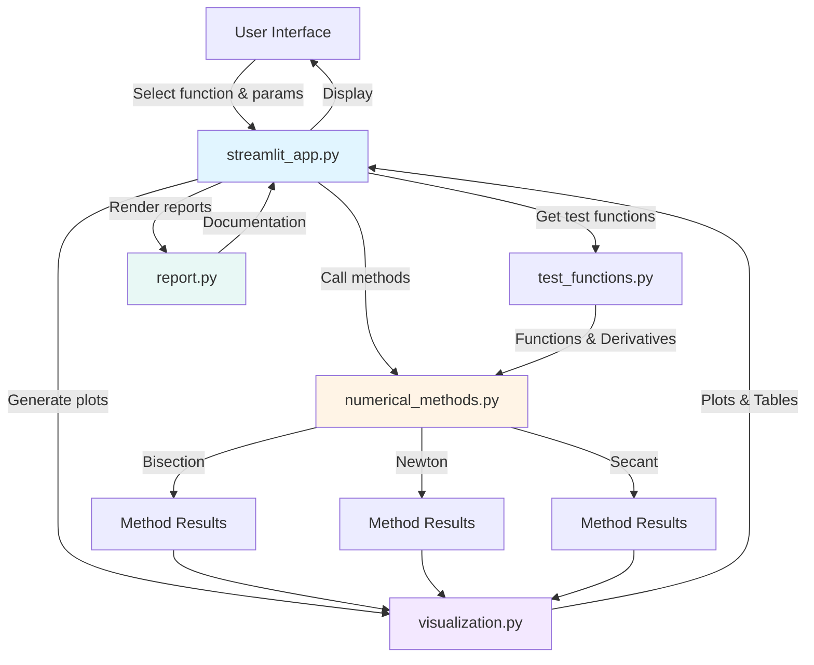

# Root-Finding Methods Analysis

**A comprehensive web application for analyzing and comparing numerical root-finding algorithms**

[](https://math374p2.streamlit.app/)
[](LICENSE)
[](https://www.python.org/downloads/)
[](https://streamlit.io/)

## Overview

This interactive web application implements, analyzes, and compares three fundamental numerical methods for finding roots of nonlinear equations. Built with Streamlit and designed for educational purposes, it provides visual demonstrations, convergence analysis, and detailed mathematical explanations suitable for students, educators, and anyone learning numerical analysis.

**Live Demo:** [https://math374p2.streamlit.app/](https://math374p2.streamlit.app/)

### What This Project Demonstrates

This project showcases practical skills in computational mathematics, software engineering, and technical documentation:

- **Numerical Algorithm Implementation** - Robust implementations of Bisection, Newton's, and Secant methods with proper error handling and numerical stability considerations ([Modules/numerical_methods.py](Modules/numerical_methods.py))
- **Scientific Visualization** - Publication-quality plots with Matplotlib showing function graphs, convergence rates, and iteration animations ([Modules/visualization.py](Modules/visualization.py))
- **Interactive Web Application** - Full-featured Streamlit dashboard with sidebar controls, tabbed interface, and real-time computation ([streamlit_app.py](streamlit_app.py))
- **Modular Software Design** - Clean separation of concerns across modules: numerical methods, test functions, visualization, and reporting ([Modules/](Modules/))
- **Mathematical Analysis** - Convergence rate estimation using log-linear regression and comparative performance analysis ([Modules/numerical_methods.py#L377-L424](Modules/numerical_methods.py))
- **Technical Documentation** - Comprehensive inline documentation, mathematical explanations, and user guides integrated directly into the application ([Modules/report.py](Modules/report.py))
- **Cloud Deployment** - Production deployment on Streamlit Community Cloud with DevContainer support for consistent development environments ([.devcontainer/devcontainer.json](.devcontainer/devcontainer.json))

## Key Features

- **Interactive UI** - Select test functions and configure method parameters (tolerances, initial guesses, max iterations) through an intuitive sidebar
- **Comprehensive Visualization** - View function plots with marked roots, iteration trajectories, and logarithmic error convergence graphs
- **Comparative Analysis** - Side-by-side comparison of convergence rates and iteration counts across all three methods
- **Detailed Mathematical Report** - In-depth explanations of algorithms, termination criteria, and convergence theory
- **Pseudocode Documentation** - Step-by-step algorithmic descriptions matching standard numerical analysis textbooks
- **Architecture Documentation** - Complete code report explaining module design, data structures, and implementation details

### Test Functions

The application analyzes three carefully selected test functions that exhibit different convergence behaviors:

- **f₁(x) = x² - 4sin(x)** - Combines polynomial and trigonometric terms, tests general convergence
- **f₂(x) = x² - 1** - Simple quadratic with known roots at x = ±1, validates implementation correctness
- **f₃(x) = x³ - 3x² + 3x - 1** - Cubic with multiple root at x = 1, challenges methods with near-zero derivatives

## Architecture

The application follows a modular architecture with clear separation of concerns. See [docs/ARCHITECTURE.md](docs/ARCHITECTURE.md) for detailed design documentation.



### Project Structure

```
Math374P2/
├── Modules/                    # Core modules
│   ├── numerical_methods.py   # Bisection, Newton's, and Secant method implementations
│   ├── test_functions.py      # Test functions (f1, f2, f3) and their derivatives
│   ├── visualization.py       # Matplotlib plotting functions for graphs and animations
│   └── report.py              # Mathematical report content and rendering
├── docs/                       # Documentation (see ARCHITECTURE.md, DEVELOPMENT.md)
├── .devcontainer/              # VS Code DevContainer configuration
│   └── devcontainer.json      # Python 3.11 environment setup
├── .github/
│   └── CODEOWNERS             # Repository ownership
├── streamlit_app.py           # Main Streamlit application entry point
├── test_streamlit.py          # Basic Streamlit functionality test
├── requirements.txt           # Python dependencies
├── LICENSE                    # Apache License 2.0
└── README.md                  # This file
```

## Quick Start

### Prerequisites

- Python 3.11 or higher
- pip (Python package installer)
- Git (for cloning the repository)

### Installation

1. **Clone the repository**

   ```bash
   git clone https://github.com/jakujobi/Math374P2.git
   cd Math374P2
   ```
2. **Create a virtual environment** (recommended)

   **Linux/macOS:**

   ```bash
   python3 -m venv venv
   source venv/bin/activate
   ```

   **Windows:**

   ```cmd
   python -m venv venv
   venv\Scripts\activate
   ```
3. **Install dependencies**

   ```bash
   pip install -r requirements.txt
   ```

### Running the Application

Start the Streamlit server:

```bash
streamlit run streamlit_app.py
```

The application will automatically open in your default web browser at `http://localhost:8501`.

### First Steps

1. **Select a test function** from the sidebar dropdown (f₁, f₂, or f₃)
2. **Configure parameters** for each method:
   - Bisection: interval endpoints [a, b]
   - Newton: initial guess x₀
   - Secant: two initial guesses a and b
3. **Adjust tolerances** if needed (default: δ₁ = δ₂ = 1e-10)
4. **Click "Run Analysis"** to compute roots and visualize results

### Example Usage

**Finding a root of f₁(x) = x² - 4sin(x) near x = 2:**

```python
from Modules.numerical_methods import newton_method
from Modules.test_functions import get_function_details

# Get function and derivative
f_details = get_function_details("f1")
f = f_details["function"]
df = f_details["derivative"]

# Run Newton's method
result = newton_method(f, df, x0=2.0, delta1=1e-10, delta2=1e-10)

print(f"Root: {result['root']:.10f}")
print(f"Converged: {result['converged']}")
print(f"Iterations: {result['iterations_count']}")
```

**Output:**

```
Root: 1.9337537628
Converged: True
Iterations: 5
```

## Usage

### Web Interface

The Streamlit interface is organized into four main tabs:

#### 1. Analysis Tab

- **Function Visualization**: Interactive plot showing the selected test function
- **Method Results**: Side-by-side comparison tables for Bisection, Newton's, and Secant methods
- **Convergence Graphs**: Logarithmic plots showing error reduction over iterations
- **Iteration Animation**: Step-by-step visualization of how each method approaches the root

#### 2. Detailed Report Tab

Mathematical explanations including:

- Algorithm descriptions and theory
- Termination criteria (δ₁ for step size, δ₂ for function value)
- Convergence rate analysis (linear, quadratic, superlinear)
- Comparative performance on test functions

#### 3. Pseudocode Tab

Standard algorithmic pseudocode for all three methods, following the notation used in numerical analysis textbooks.

#### 4. Code Report Tab

Technical documentation of the implementation, including:

- Module descriptions and responsibilities
- Data structures and design patterns
- Development process and challenges

### Programmatic Usage

All numerical methods can be imported and used directly in Python scripts:

**Bisection Method:**

```python
from Modules.numerical_methods import bisection_method

result = bisection_method(
    f=lambda x: x**2 - 4*np.sin(x),  # Function
    a=1.0,                             # Left endpoint
    b=3.0,                             # Right endpoint
    delta=1e-10,                       # Interval tolerance
    epsilon=1e-10,                     # Function value tolerance
    max_iterations=100
)
```

**Newton's Method:**

```python
from Modules.numerical_methods import newton_method

result = newton_method(
    f=lambda x: x**2 - 1,              # Function
    df=lambda x: 2*x,                  # Derivative
    x0=0.5,                            # Initial guess
    delta1=1e-10,                      # Step size tolerance
    delta2=1e-10,                      # Function value tolerance
    max_iterations=100
)
```

**Secant Method:**

```python
from Modules.numerical_methods import secant_method

result = secant_method(
    f=lambda x: x**3 - 3*x**2 + 3*x - 1,  # Function
    a=0.5,                                 # First initial guess
    b=1.5,                                 # Second initial guess
    delta1=1e-10,                          # Step size tolerance
    delta2=1e-10,                          # Function value tolerance
    max_iterations=100
)
```

**Result Dictionary Structure:**

```python
{
    'root': float,                    # Approximate root value
    'iterations': List[Dict],         # Detailed iteration history
    'converged': bool,                # Whether method converged
    'iterations_count': int,          # Number of iterations performed
    'error_history': List[float],     # Error at each iteration
    'function_values': List[float],   # f(x) at each iteration
    'error_message': str              # Error description (if failed)
}
```

## Configuration

### Method Parameters

Parameters can be configured through the web interface or when calling methods programmatically:

| Parameter                | Description                               | Default | Range  |
| ------------------------ | ----------------------------------------- | ------- | ------ |
| `delta` / `delta1`   | Tolerance for interval width or step size | 1e-10   | > 0    |
| `epsilon` / `delta2` | Tolerance for function value\|f(x)\|      | 1e-10   | > 0    |
| `max_iterations`       | Maximum number of iterations allowed      | 100     | 1-1000 |
| `a`, `b`             | Initial interval or guesses               | Varies  | ℝ     |
| `x0`                   | Initial guess (Newton's method only)      | Varies  | ℝ     |

### Termination Criteria

All methods stop when one of the following conditions is met:

1. **Step size criterion**: \|xₙ₊₁ - xₙ\| < δ₁ (ensures consecutive approximations are close)
2. **Function value criterion**: \|f(x)\| < δ₂ (ensures the value is close to zero)
3. **Maximum iterations**: Prevents infinite loops in non-convergent cases

### Environment Configuration

No environment variables are required. All configuration is done through the UI or method parameters.

For deployment on Streamlit Community Cloud, the app uses default Streamlit configuration. To customize server settings locally, create `.streamlit/config.toml`:

```toml
[server]
port = 8501
headless = true

[browser]
gatherUsageStats = false
```

## Testing and Quality

### Running Tests

A basic test file is provided to verify Streamlit functionality:

```bash
python test_streamlit.py
```

### Manual Testing

To test the numerical methods directly:

```bash
python -c "
from Modules.numerical_methods import bisection_method, newton_method, secant_method
from Modules.test_functions import f2, df2
import numpy as np

# Test Newton's method on f2(x) = x^2 - 1 (known root at x=1)
result = newton_method(f2, df2, x0=0.5)
print(f'Newton Method - Root: {result[\"root\"]:.10f}, Expected: 1.0')
print(f'Converged: {result[\"converged\"]}, Iterations: {result[\"iterations_count\"]}')

# Test bisection method
result = bisection_method(f2, a=0.0, b=2.0)
print(f'Bisection Method - Root: {result[\"root\"]:.10f}, Expected: 1.0')
print(f'Converged: {result[\"converged\"]}, Iterations: {result[\"iterations_count\"]}')
"
```

### Code Quality

- **Type Annotations**: All functions use Python type hints for clarity and static analysis
- **Docstrings**: Comprehensive documentation following NumPy docstring conventions
- **Error Handling**: Robust checks for numerical instabilities (division by zero, small derivatives)
- **Numerical Stability**: Tolerance checks to prevent floating-point issues

### Known Limitations

- Newton's method may fail if the derivative is zero or very small near the initial guess
- Secant method requires two distinct initial guesses
- Bisection method requires a sign change in the initial interval
- All methods may not converge if the function is discontinuous or has no roots in the search region

## Development

See [docs/DEVELOPMENT.md](docs/DEVELOPMENT.md) for detailed development setup, project structure, and contribution guidelines.

### Development Setup

1. Clone the repository and create a virtual environment (see Quick Start)
2. Install dependencies: `pip install -r requirements.txt`
3. For VS Code users, use the included DevContainer for a consistent environment

### Using DevContainers

The repository includes a DevContainer configuration for VS Code:

1. Install Docker and the VS Code Remote-Containers extension
2. Open the repository in VS Code
3. Click "Reopen in Container" when prompted
4. The environment will be automatically configured with Python 3.11 and all dependencies

## Project Status

**Status**: Complete and Deployed

This project was developed for MATH 374: Scientific Computation (Spring 2025) at South Dakota State University. The application is fully functional and deployed at [https://math374p2.streamlit.app/](https://math374p2.streamlit.app/).

### Verified Features

All features listed above have been implemented and tested:

- Three numerical methods (Bisection, Newton's, Secant) working correctly
- Three test functions with verified roots
- Interactive web interface with real-time computation
- Comprehensive visualizations (function plots, convergence graphs, animations)
- Convergence rate estimation using log-linear regression
- Detailed mathematical report and pseudocode documentation
- Live deployment on Streamlit Community Cloud

### Future Enhancements (Optional)

Potential improvements that could be added:

- Additional test functions with different characteristics
- More root-finding methods (e.g., False Position, Ridder's, Brent's method)
- Export functionality for results and plots
- Batch analysis mode for parameter sensitivity studies
- Performance benchmarking suite

## Technologies Used

| Technology                         | Version  | Purpose                                     |
| ---------------------------------- | -------- | ------------------------------------------- |
| [Python](https://www.python.org/)     | 3.11+    | Core programming language                   |
| [Streamlit](https://streamlit.io/)    | ≥1.24.0 | Web application framework                   |
| [NumPy](https://numpy.org/)           | ≥1.24.0 | Numerical computations and array operations |
| [Matplotlib](https://matplotlib.org/) | ≥3.7.0  | Data visualization and plotting             |
| [Pandas](https://pandas.pydata.org/)  | ≥2.0.0  | Data handling and table formatting          |

## Contributing

Contributions are welcome! This is an educational project, and improvements to documentation, additional test functions, or new numerical methods would be valuable.

See [docs/CONTRIBUTING.md](docs/CONTRIBUTING.md) for guidelines on:

- Code style and conventions
- Submitting pull requests
- Adding new features or test functions
- Reporting issues

## License

This project is licensed under the **Apache License 2.0** - see the [LICENSE](LICENSE) file for full details.

```
Copyright 2025 John Akujobi

Licensed under the Apache License, Version 2.0 (the "License");
you may not use this file except in compliance with the License.
You may obtain a copy of the License at

    http://www.apache.org/licenses/LICENSE-2.0

Unless required by applicable law or agreed to in writing, software
distributed under the License is distributed on an "AS IS" BASIS,
WITHOUT WARRANTIES OR CONDITIONS OF ANY KIND, either express or implied.
See the License for the specific language governing permissions and
limitations under the License.
```

## Academic Context

**Course**: MATH 374 - Scientific Computation (Spring 2025)
**Institution**: South Dakota State University
**Professor**: Dr. Jung-Han Kimn
**Project**: Project 2 - Root-Finding Methods Analysis

### References

The numerical methods implemented in this project are based on standard algorithms from:

- Cheney, W., & Kincaid, D. (2012). *Numerical Mathematics and Computing* (7th ed.).
- Burden, R. L., & Faires, J. D. (2010). *Numerical Analysis* (9th ed.).
- Atkinson, K. E. (1989). *An Introduction to Numerical Analysis* (2nd ed.).

## Author

**John Akujobi**

- GitHub: [@jakujobi](https://github.com/jakujobi)
- Website: [jakujobi.com](https://jakujobi.com)
- Institution: South Dakota State University

---

**⭐ If you find this project helpful, please consider giving it a star on GitHub!**
